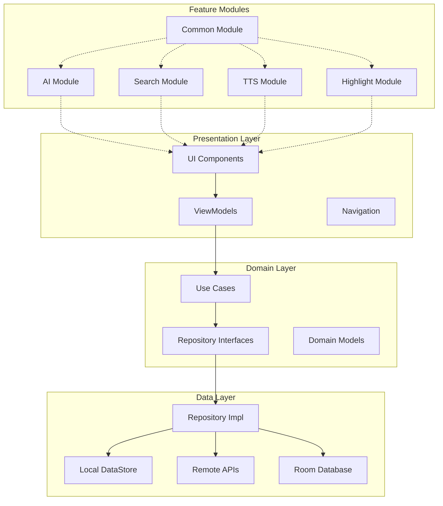

# RikkaHub 核心项目架构设计文档

## 概述

本文档描述了 RikkaHub 核心项目架构的技术设计，涵盖多模块 Android 应用的整体架构、组件设计、数据流和技术选型。RikkaHub 采用现代化的 Android 开发模式，结合 Clean Architecture、MVVM 和模块化设计原则，实现一个可扩展、可维护的 AI 聊天客户端。

## 指导文档对齐

### 技术标准
基于项目现有的技术栈和最佳实践：
- **Kotlin**: 主要开发语言，利用协程和 Flow 进行异步处理
- **Jetpack Compose**: 现代 UI 框架，声明式 UI 开发
- **Clean Architecture**: 分层架构，确保业务逻辑与框架解耦
- **Dependency Injection**: 使用 Koin 进行依赖管理
- **Material Design 3**: 遵循 Google 设计规范

### 项目结构
遵循 Android 多模块项目组织：
- **功能模块化**: 按功能域划分模块（ai、search、tts 等）
- **层次分离**: 明确的数据层、业务层、表现层分离
- **接口抽象**: 模块间通过接口通信，降低耦合度

## 代码复用分析

### 现有组件利用

- **Provider 抽象层**: `ai/provider/Provider.kt` - 统一的 AI 提供商接口
- **搜索服务抽象**: `search/SearchService.kt` - 多搜索引擎统一接口
- **数据存储层**: `app/data/datastore/PreferencesStore.kt` - 配置持久化
- **数据库层**: `app/data/db/` - Room 数据库实体和 DAO
- **UI 组件库**: `app/ui/components/` - 可复用的 Compose 组件

### 集成点

- **AI Provider 系统**: 新功能将扩展现有的 Provider 架构
- **Repository 模式**: 利用现有 Repository 进行数据管理
- **ViewModel 架构**: 遵循现有的 MVVM 模式
- **导航系统**: 基于 Navigation Compose 的应用导航

## 架构设计

### 整体架构模式

采用 Clean Architecture 结合模块化设计：



### 模块化设计原则

- **单一文件职责**: 每个 Kotlin 文件专注于单一功能域
- **组件隔离**: 创建小而专注的组件，避免大型单体文件
- **服务层分离**: 明确分离数据访问、业务逻辑和表现层
- **工具模块化**: 将工具函数分解为专注的单一用途模块

## 组件和接口设计

### 核心 AI Provider 组件

- **Purpose**: 提供统一的 AI 提供商抽象，支持多种 AI 服务
- **Interfaces**:
  - `Provider<T>` - 通用提供商接口
  - `TextGenerationProvider` - 文本生成专用接口
  - `ImageGenerationProvider` - 图像生成专用接口
- **Dependencies**: OkHttp 客户端、序列化工具、配置存储
- **Reuses**: 现有的 `ProviderManager`、`ProviderSetting`、模型注册表

### 搜索服务组件

- **Purpose**: 统一多搜索引擎接口，提供搜索和抓取功能
- **Interfaces**:
  - `SearchService<T>` - 泛型搜索服务接口
  - `ScrapableSearchService` - 支持网页抓取的搜索接口
- **Dependencies**: HTTP 客户端、JSON 序列化、配置管理
- **Reuses**: 现有的 `SearchResult`、`SearchServiceOptions` 数据模型

### 数据管理层组件

- **Purpose**: 管理应用数据持久化和缓存
- **Interfaces**:
  - `ConversationRepository` - 对话数据仓库
  - `ProviderRepository` - 提供商配置仓库
  - `SearchRepository` - 搜索历史仓库
- **Dependencies**: Room 数据库、DataStore、文件系统
- **Reuses**: 现有的数据库实体、DAO 接口、迁移策略

### UI 层组件

- **Purpose**: 提供用户界面和交互体验
- **Interfaces**:
  - `ChatViewModel` - 聊天界面状态管理
  - `SettingViewModel` - 设置页面状态管理
  - `SearchViewModel` - 搜索功能状态管理
- **Dependencies**: Compose UI、Navigation、状态管理
- **Reuses**: 现有的 UI 组件库、主题系统、导航结构

## 数据模型设计

### 对话数据模型
```kotlin
data class Conversation(
    val id: Uuid = Uuid.random(),
    val assistantId: Uuid,
    val title: String = "",
    val messageNodes: List<MessageNode>,
    val truncateIndex: Int = -1,
    val chatSuggestions: List<String> = emptyList(),
    val isPinned: Boolean = false,
    val createAt: Instant = Instant.now(),
    val updateAt: Instant = Instant.now(),
)

data class MessageNode(
    val id: Uuid = Uuid.random(),
    val messages: List<UIMessage>,
    val selectIndex: Int = 0,
)
```

### AI Provider 配置模型
```kotlin
sealed class ProviderSetting {
    abstract val id: Uuid
    abstract val enabled: Boolean
    abstract val name: String

    data class OpenAI(
        override val id: Uuid,
        override val enabled: Boolean,
        override val name: String,
        val apiKey: String,
        val baseUrl: String,
        val models: List<Model>
    ) : ProviderSetting()
}
```

### 搜索服务模型
```kotlin
data class SearchResult(
    val items: List<SearchResultItem>,
    val totalResults: Int?,
    val searchTime: Double,
    val provider: String
)

data class SearchResultItem(
    val title: String,
    val url: String,
    val text: String,
    val score: Double?,
    val publishedDate: String?
)
```

## 错误处理策略

### 网络错误场景
1. **API 连接失败**
   - **处理**: 自动重试机制（最多3次），指数退避
   - **用户影响**: 显示重试按钮，提供离线模式选项

2. **API 密钥无效**
   - **处理**: 清除无效密钥，提示用户重新配置
   - **用户影响**: 跳转到设置页面，显示配置指导

3. **模型不可用**
   - **处理**: 自动切换到备用模型，记录错误日志
   - **用户影响**: 显示模型切换通知，提供手动选择选项

### 数据错误场景
1. **数据库迁移失败**
   - **处理**: 回滚到上一版本，触发错误报告
   - **用户影响**: 显示迁移失败提示，提供重置选项

2. **文件系统权限错误**
   - **处理**: 请求必要权限，使用备用存储路径
   - **用户影响**: 显示权限请求对话框，说明权限用途

## 测试策略

### 单元测试
- **测试框架**: JUnit 5 + MockK
- **覆盖范围**:
  - Repository 层数据操作
  - ViewModel 状态管理逻辑
  - Provider 接口实现
  - 工具函数和扩展
- **关键组件**:
  - `ConversationRepository` - 对话数据管理
  - `ProviderManager` - 提供商切换逻辑
  - `SearchService` 实现 - 搜索功能验证

### 集成测试
- **测试框架**: AndroidJUnit4 + Room 测试
- **测试场景**:
  - 数据库迁移验证
  - API 集成流程测试
  - 模块间接口调用测试
  - 配置持久化验证
- **关键流程**:
  - 完整的聊天对话流程
  - 提供商配置和切换流程
  - 搜索功能集成流程

### 端到端测试
- **测试框架**: Espresso + Compose Testing
- **用户场景**:
  - 新用户首次使用流程
  - 多提供商切换使用场景
  - 本地和云端模型混合使用
  - 文件上传和多媒体交互
  - 搜索功能集成使用
- **关键路径**:
  - 从安装到完整对话的完整用户旅程
  - 错误恢复和用户引导流程
  - 性能关键路径验证

## 性能优化策略

### 内存管理
- **图片缓存**: 使用 Coil 进行智能图片缓存
- **对话历史**: 分页加载长对话历史
- **模型缓存**: 本地模型文件智能缓存策略

### 网络优化
- **请求合并**: 批量处理相似的 API 请求
- **连接池**: OkHttp 连接池优化
- **缓存策略**: HTTP 响应缓存和离线支持

### UI 性能
- **Lazy Loading**: 大列表使用 LazyColumn
- **状态优化**: 最小化重组，使用 derivedStateOf
- **动画性能**: 使用 Compose 动画最佳实践

## 安全设计

### 数据加密
- **API 密钥**: Android Keystore 存储
- **本地数据**: SQLCipher 数据库加密
- **网络传输**: 强制 HTTPS，证书绑定

### 权限管理
- **最小权限原则**: 仅请求必要权限
- **运行时权限**: 动态权限请求和处理
- **权限说明**: 清晰的权限用途说明

## 国际化支持

### 多语言设计
- **资源结构**: `values-*/strings.xml` 标准结构
- **动态切换**: 运行时语言切换支持
- **文本处理**: 复数形式和文本方向处理

### 本地化策略
- **文本外部化**: 所有用户可见文本资源化
- **文化适配**: 日期格式、数字格式本地化
- **RTL 支持**: 从右到左语言支持