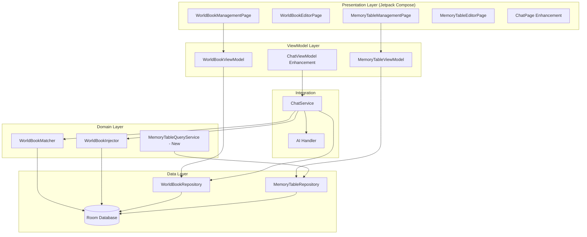

# Design Document: World Book and Memory Table Integration

## Overview

This design completes the integration of World Book and Memory Table features into the RikkaHub Android application. The implementation leverages existing database layer, repository patterns, and core service logic to provide seamless AI-powered knowledge injection and structured data management.

The feature operates within the existing MVVM + Repository architecture, extending the ChatService to include intelligent context injection, and providing new Jetpack Compose-based UI for knowledge management. The design emphasizes modularity, performance, and seamless integration with existing systems.

## Steering Document Alignment

### Technical Standards (tech.md)
- **MVVM Architecture**: All UI components follow ViewModel + StateFlow pattern established in the application
- **Dependency Injection**: Uses Koin for service registration and lifecycle management
- **Reactive Programming**: Coroutines + Flow for all async operations and data streams
- **Jetpack Compose**: UI layer uses Compose instead of legacy Android View system
- **Room Database**: Continues to use Room for data persistence with proper migrations

### Project Structure (structure.md)
- **Feature Module Organization**: Follows existing pattern of separating data, domain, and presentation layers
- **Component Isolation**: Each service, ViewModel, and UI component has a single, well-defined responsibility
- **Consistent Naming**: Uses established naming conventions (e.g., `*ViewModel.kt`, `*Repository.kt`)
- **Resource Management**: Leverages existing resource structure under `app/src/main/java/me/rerere/rikkahub/`

## Code Reuse Analysis

### Existing Components to Leverage

#### Database Layer (100% Complete)
- **`WorldBookEntry`** (`app/src/main/java/me/rerere/rikkahub/data/db/entity/WorldBookEntry.kt`)
  - **Usage**: No changes needed, fully implemented with all required fields
  - **Fields**: id, assistantId, title, keywords, secondaryKeywords, content, comment, isConstant, isSelective, priority, injectionPosition, isEnabled, excludeRecursion, useRegex, createdAt, updatedAt

- **`MemoryTable`** and **`MemoryTableRow`** (`app/src/main/java/me/rerere/rikkahub/data/db/entity/`)
  - **Usage**: No changes needed, fully implemented with proper relationships
  - **Features**: Support for dynamic columns via columnHeaders, flexible rowData storage

- **`WorldBookDAO`** and **`MemoryTableDAO`** (`app/src/main/java/me/rerere/rikkahub/data/db/dao/`)
  - **Usage**: No changes needed, provides full CRUD operations
  - **Methods**: getActiveWorldBookEntries(), searchWorldBookEntries(), getRowsByTableId(), etc.

#### Repository Layer (100% Complete)
- **`WorldBookRepository`** (`app/src/main/java/me/rerere/rikkahub/data/repository/WorldBookRepository.kt`)
  - **Usage**: Inject into ChatService and ViewModels
  - **Methods**: getWorldBookEntriesByAssistant(), addEntry(), updateEntry(), deleteEntry()

- **`MemoryTableRepository`** (`app/src/main/java/me/rerere/rikkahub/data/repository/MemoryTableRepository.kt`)
  - **Usage**: Inject into ChatService and ViewModels
  - **Methods**: getMemoryTablesByAssistant(), addTable(), updateTable(), getRowsByTableId()

#### Core Services (100% Complete)
- **`WorldBookMatcher`** (`app/src/main/java/me/rerere/rikkahub/service/WorldBookMatcher.kt`)
  - **Usage**: Inject into ChatService and ViewModels
  - **Features**: Keyword matching, regex support, recursive scanning, priority sorting
  - **Performance**: O(n) matching with optimization for active entries only

- **`WorldBookInjector`** (`app/src/main/java/me/rerere/rikkahub/service/WorldBookInjector.kt`)
  - **Usage**: Inject into ChatService
  - **Features**: Context injection, formatting (STRUCTURED/MINIMAL/MARKDOWN), deduplication, token limiting
  - **Integration**: Converts matched entries to SYSTEM role messages

#### Model Layer (70% Complete)
- **`Assistant`** (`app/src/main/java/me/rerere/rikkahub/data/model/Assistant.kt`)
  - **Usage**: Already includes enableWorldBook, worldBookContextSize, worldBookMaxHistoryMessages, worldBookMaxRecursionDepth, worldBookFormatStyle, enableMemoryTable
  - **Extension Needed**: Add UI controls in AssistantDetailPage to configure these fields

### Integration Points

#### ChatService Integration
- **File**: `app/src/main/java/me/rerere/rikkahub/service/ChatService.kt`
- **Integration Point**: `handleMessageComplete()` method (line 345)
- **Changes**:
  1. Add constructor parameters: `worldBookRepository`, `worldBookMatcher`, `worldBookInjector`
  2. In `handleMessageComplete()`: fetch active entries, match against context, inject into messages
  3. Pass injected messages to `generationHandler.generateText()`

#### Koin Dependency Injection
- **File**: `app/src/main/java/me/rerere/rikkahub/di/AppModule.kt`
- **Changes**: Register WorldBookMatcher and WorldBookInjector as singletons
- **Existing**: RepositoryModule already registers repositories

#### Navigation and Routing
- **File**: `app/src/main/java/me/rerere/rikkahub/RouteActivity.kt`
- **Routes Already Defined**: WorldBook, WorldBookEditor, MemoryTable, MemoryTableEditor (but commented)
- **Changes**: Implement UI composables and enable routes

## Architecture

The implementation follows **Clean Architecture** with **MVVM** pattern:



### Modular Design Principles

- **Single File Responsibility**: Each service handles one concern
  - `WorldBookMatcher`: Matching logic only
  - `WorldBookInjector`: Injection logic only
  - `MemoryTableQueryService`: Table querying and formatting only
  - ViewModels: State management only
  - UI Composables: View rendering only

- **Component Isolation**:
  - No direct database access from UI
  - No business logic in Composables
  - Services are independent and testable

- **Service Layer Separation**:
  - **Data Access**: Repository + DAO
  - **Business Logic**: Matcher, Injector, QueryService
  - **Integration**: ChatService orchestrates flow

- **Utility Modularity**:
  - Formatters (Markdown, CSV) separated from query logic
  - Matchers are composable and reusable
  - Converters are single-purpose

## Components and Interfaces

### Component 1: WorldBookMatcher Service
- **Purpose**: Scan user input and conversation history to find matching world book entries
- **Interfaces**:
  ```kotlin
  class WorldBookMatcher {
      fun matchEntries(
          input: String,
          conversationHistory: List<UIMessage>,
          entries: List<WorldBookEntry>,
          maxHistoryMessages: Int = 5,
          maxRecursionDepth: Int = 3
      ): List<MatchedEntry>

      data class MatchedEntry(
          val entry: WorldBookEntry,
          val matchDepth: Int = 0,
          val matchedKeywords: List<String> = emptyList()
      )
  }
  ```
- **Dependencies**: None (pure business logic)
- **Reuses**: None (self-contained algorithm)

### Component 2: WorldBookInjector Service
- **Purpose**: Format and inject matched world book entries into conversation messages
- **Interfaces**:
  ```kotlin
  class WorldBookInjector {
      fun injectWorldBook(
          messages: List<UIMessage>,
          matchedEntries: List<WorldBookMatcher.MatchedEntry>,
          assistant: Assistant,
          config: InjectionConfig = InjectionConfig()
      ): List<UIMessage>

      data class InjectionConfig(
          val maxTokens: Int = 2000,
          val enableDeduplication: Boolean = true,
          val formatStyle: FormatStyle = FormatStyle.STRUCTURED
      )
  }
  ```
- **Dependencies**: Assistant model, UIMessage types
- **Reuses**: None (formatting logic is specific to this feature)

### Component 3: MemoryTableQueryService (New)
- **Purpose**: Query memory tables and format results for AI consumption or user export
- **Interfaces**:
  ```kotlin
  class MemoryTableQueryService(
      private val memoryTableRepository: MemoryTableRepository
  ) {
      suspend fun searchTables(
          assistantId: String,
          query: String
      ): List<MemoryTableSearchResult>

      fun formatTableAsMarkdown(table: MemoryTable, rows: List<MemoryTableRow>): String

      fun exportTableAsCSV(table: MemoryTable, rows: List<MemoryTableRow>): String

      suspend fun importTableFromCSV(
          assistantId: String,
          csvContent: String
      ): Result<MemoryTable>
  }
  ```
- **Dependencies**: MemoryTableRepository, CSV/Markdown formatters
- **Reuses**: Repository layer for data access

### Component 4: WorldBookViewModel
- **Purpose**: Manage state for world book entry list and editor
- **Interfaces**:
  ```kotlin
  class WorldBookViewModel(
      private val repository: WorldBookRepository
  ) : ViewModel() {
      private val _entries = MutableStateFlow<List<WorldBookEntry>>(emptyList())
      val entries: StateFlow<List<WorldBookEntry>> = _entries.asStateFlow()

      private val _searchQuery = MutableStateFlow("")
      val searchQuery: StateFlow<String> = _searchQuery.asStateFlow()

      fun setAssistantId(assistantId: String)

      fun updateSearchQuery(query: String)

      fun addEntry(entry: WorldBookEntry)

      fun updateEntry(entry: WorldBookEntry)

      fun deleteEntry(id: String)
  }
  ```
- **Dependencies**: WorldBookRepository
- **Reuses**: Existing ViewModel pattern from AssistantViewModel

### Component 5: MemoryTableViewModel
- **Purpose**: Manage state for memory table list and editor
- **Interfaces**:
  ```kotlin
  class MemoryTableViewModel(
      private val repository: MemoryTableRepository
  ) : ViewModel() {
      private val _tables = MutableStateFlow<List<MemoryTable>>(emptyList())
      val tables: StateFlow<List<MemoryTable>> = _tables.asStateFlow()

      private val _selectedTable = MutableStateFlow<MemoryTable?>(null)
      val selectedTable: StateFlow<MemoryTable?> = _selectedTable.asStateFlow()

      private val _tableRows = MutableStateFlow<List<MemoryTableRow>>(emptyList())
      val tableRows: StateFlow<List<MemoryTableRow>> = _tableRows.asStateFlow()

      fun setAssistantId(assistantId: String)

      suspend fun createTable(name: String, description: String, columns: List<String>)

      suspend fun deleteTable(id: String)

      fun selectTable(id: String)

      suspend fun addRow(tableId: String, rowData: Map<String, String>)

      suspend fun updateRow(row: MemoryTableRow)

      suspend fun deleteRow(id: String)
  }
  ```
- **Dependencies**: MemoryTableRepository
- **Reuses**: Existing ViewModel pattern

### Component 6: ChatService Enhancement
- **Purpose**: Integrate world book matching and injection into chat flow
- **Modified Interfaces**:
  ```kotlin
  class ChatService(
      // Existing parameters
      private val worldBookRepository: WorldBookRepository,
      private val worldBookMatcher: WorldBookMatcher,
      private val worldBookInjector: WorldBookInjector
  ) {
      private suspend fun handleMessageComplete(
          conversationId: Uuid,
          messageRange: ClosedRange<Int>? = null
      ) {
          val settings = settingsStore.settingsFlow.first()
          val assistant = settings.getCurrentAssistant()

          // NEW: World Book Integration
          if (assistant.enableWorldBook) {
              val worldBookEntries = worldBookRepository
                  .getActiveWorldBookEntries(assistant.id.toString())

              val matchedEntries = worldBookMatcher.matchEntries(
                  input = conversation.currentMessages.lastOrNull()?.toText() ?: "",
                  conversationHistory = conversation.currentMessages.takeLast(
                      assistant.worldBookMaxHistoryMessages
                  ),
                  entries = worldBookEntries,
                  maxRecursionDepth = assistant.worldBookMaxRecursionDepth
              )

              val messagesWithWorldBook = worldBookInjector.injectWorldBook(
                  messages = conversation.currentMessages,
                  matchedEntries = matchedEntries,
                  assistant = assistant,
                  config = WorldBookInjector.InjectionConfig(
                      maxTokens = assistant.worldBookContextSize,
                      formatStyle = assistant.worldBookFormatStyle
                  )
              )

              // Use injected messages for generation
              generationHandler.generateText(
                  settings = settings,
                  model = model,
                  messages = messagesWithWorldBook,
                  // ... other parameters
              )
          } else {
              // Existing logic without world book
          }
      }
  }
  ```
- **Dependencies**: WorldBookRepository, WorldBookMatcher, WorldBookInjector
- **Reuses**: Existing chat flow, generation logic

### Component 7: Jetpack Compose UI Screens

#### WorldBookManagementPage
- **Purpose**: Display and manage world book entries for an assistant
- **Structure**:
  ```kotlin
  @Composable
  fun WorldBookManagementPage(
      navController: NavController,
      assistantId: String
  ) {
      val viewModel: WorldBookViewModel = koinViewModel()
      val entries by viewModel.entries.collectAsState()
      val searchQuery by viewModel.searchQuery.collectAsState()

      Scaffold(
          topBar = {
              TopAppBar(
                  title = { Text("World Book") },
                  navigationIcon = { IconButton(onClick = { navController.popBackStack() }) {
                      Icon(Icons.Default.ArrowBack, contentDescription = "Back")
                  }}
              )
          },
          floatingActionButton = {
              FloatingActionButton(
                  onClick = { navController.navigate(Screen.WorldBookEditor()) }
              ) {
                  Icon(Icons.Default.Add, contentDescription = "Add")
              }
          }
      ) { padding ->
          Column(modifier = Modifier.padding(padding)) {
              // Search bar
              OutlinedTextField(
                  value = searchQuery,
                  onValueChange = viewModel::updateSearchQuery,
                  placeholder = { Text("Search entries...") },
                  modifier = Modifier.fillMaxWidth().padding(16)
              )

              // Entry list
              LazyColumn {
                  items(entries) { entry ->
                      WorldBookEntryCard(
                          entry = entry,
                          onClick = { navController.navigate(Screen.WorldBookEditor(entry.id)) },
                          onToggleEnabled = { viewModel.updateEntry(entry.copy(isEnabled = !entry.isEnabled)) },
                          onDelete = { viewModel.deleteEntry(entry.id) }
                      )
                  }
              }
          }
      }
  }
  ```

#### WorldBookEditorPage
- **Purpose**: Create and edit world book entries
- **Key Features**:
  - Title text field
  - Keywords tag input with autocomplete
  - Secondary keywords with AND/OR toggle
  - Content text area (supports long text)
  - Comment field
  - Priority slider
  - Toggle switches: isConstant, isSelective, excludeRecursion, useRegex
  - Injection position selector (0=beginning, 1=end)
  - Live preview of formatted output

#### MemoryTableManagementPage
- **Purpose**: Display and manage memory tables for an assistant
- **Structure**: Similar to WorldBookManagementPage but with table-specific features
- **Actions**: Create table, delete table, edit table (navigates to editor)

#### MemoryTableEditorPage
- **Purpose**: Create and edit memory tables with Excel-like interface
- **Key Features**:
  - Table name and description fields
  - Column header management (add/remove/rename columns)
  - Row data editing with text fields
  - Drag-and-drop row reordering (using Reorderable library already in dependencies)
  - Import from CSV button
  - Export to CSV/Markdown buttons
  - Save/cancel actions

#### ChatPage Knowledge Base Button
- **Purpose**: Provide quick access to knowledge base management from chat
- **Location**: TopAppBar actions
- **Implementation**:
  ```kotlin
  TopAppBar(
      title = { Text("Chat") },
      actions = {
          // Existing actions (settings, menu, etc.)

          // NEW: Knowledge Base Button
          IconButton(
              onClick = {
                  showKnowledgeBaseDialog(
                      assistantId = settings.assistantId.toString(),
                      onWorldBookClick = { navController.navigate(Screen.WorldBook) },
                      onMemoryTableClick = { navController.navigate(Screen.MemoryTable) }
                  )
              }
          ) {
              Icon(Lucide.BookOpen, contentDescription = "Knowledge Base")
          }
      }
  )
  ```

## Data Models

### Model 1: MatchedEntry (from WorldBookMatcher)
```kotlin
data class MatchedEntry(
    val entry: WorldBookEntry,
    val matchDepth: Int = 0,
    val matchedKeywords: List<String> = emptyList()
)
```

### Model 2: MemoryTableSearchResult (New)
```kotlin
data class MemoryTableSearchResult(
    val table: MemoryTable,
    val rows: List<MemoryTableRow>,
    val matchedColumns: List<String> // Which columns had matches
)
```

### Model 3: InjectionConfig (from WorldBookInjector)
```kotlin
data class InjectionConfig(
    val maxTokens: Int = 2000,
    val enableDeduplication: Boolean = true,
    val formatStyle: FormatStyle = FormatStyle.STRUCTURED
)
```

### Model 4: KnowledgeBaseDialogState (New)
```kotlin
data class KnowledgeBaseDialogState(
    val isVisible: Boolean = false,
    val assistantId: String = "",
    val worldBookEntryCount: Int = 0,
    val memoryTableCount: Int = 0
)
```

## Error Handling

### Error Scenarios

1. **World Book Matching Failure**
   - **Scenario**: WorldBookMatcher throws exception during matching
   - **Handling**: Log error, return empty list, allow chat to continue without world book
   - **User Impact**: Chat works normally, but no world book context injected
   - **Code Location**: ChatService.handleMessageComplete() try-catch block

2. **Database Query Failure**
   - **Scenario**: DAO methods throw SQL exceptions
   - **Handling**: Repository layer catches exceptions, returns Result.failure()
   - **User Impact**: Show error toast, refresh data on retry
   - **Code Location**: Repository implementations, ViewModel error handling

3. **Memory Table Import Validation Failure**
   - **Scenario**: CSV import has invalid format or data
   - **Handling**: Return Result.failure() with detailed error message
   - **User Impact**: Show validation errors inline, prevent import
   - **Code Location**: MemoryTableQueryService.importTableFromCSV()

4. **UI Validation Errors**
   - **Scenario**: User enters invalid data (empty title, no keywords, etc.)
   - **Handling**: Show inline validation errors, prevent save
   - **User Impact**: Clear error messages, highlighting invalid fields
   - **Code Location**: WorldBookEditorPage/MemoryTableEditorPage composables

5. **Navigation Errors**
   - **Scenario**: Invalid assistant ID or missing entry ID
   - **Handling**: Show error screen, provide back navigation option
   - **User Impact**: Clear error message with navigation option
   - **Code Location**: ViewModels and Composable error states

## Testing Strategy

### Unit Testing

#### WorldBookMatcher
- Test exact keyword matching (case-insensitive)
- Test regex matching with valid and invalid patterns
- Test secondary keywords with AND logic (isSelective=true)
- Test secondary keywords with OR logic (isSelective=false)
- Test recursive matching with depth limit
- Test priority sorting (higher priority first)
- Test deduplication (same entry not matched twice)
- Test disabled entries are excluded
- Test constant entries are always included

#### WorldBookInjector
- Test basic injection adds SYSTEM message
- Test injection position (beginning vs end)
- Test different format styles (STRUCTURED, MINIMAL, MARKDOWN)
- Test deduplication removes duplicate entries
- Test token limit truncation
- Test empty entries return original messages

#### MemoryTableQueryService
- Test search finds matching rows
- Test Markdown formatting includes headers and data
- Test CSV export has proper headers and formatting
- Test CSV import validates and creates table
- Test import failure with invalid CSV shows errors

#### ViewModels
- Test state updates when repository calls succeed
- Test error handling when repository calls fail
- Test search query filtering works correctly
- Test CRUD operations update state appropriately

### Integration Testing

#### ChatService Integration
- Test world book matching enabled: messages include injected context
- Test world book matching disabled: no injection occurs
- Test performance with large number of entries (50+)
- Test recursive matching triggers additional entries
- Test token limit prevents context overflow

#### Database Integration
- Test CRUD operations persist correctly
- Test foreign key constraints (memory table rows -> table)
- Test migrations work correctly
- Test concurrent access doesn't cause issues

### End-to-End Testing

#### Complete World Book Flow
1. User creates assistant with world book enabled
2. User creates world book entries with keywords
3. User starts chat conversation
4. User mentions keywords in message
5. System matches and injects world book context
6. AI responds using injected context
7. User verifies response includes world book information

#### Complete Memory Table Flow
1. User creates assistant with memory table enabled
2. User creates memory table with columns
3. User adds row data to table
4. User queries table via AI tool
5. AI receives formatted table data
6. AI uses table data in response

#### UI Management Flow
1. User navigates to World Book management
2. User creates new entry with all fields
3. User edits entry, changes keywords and content
4. User searches for entry using filters
5. User toggles entry enabled/disabled
6. User deletes entry (with confirmation)
7. User exports entries (if implemented)
8. User imports entries (if implemented)

#### Edge Cases
1. Large number of world book entries (100+)
2. Very long content in entries (token limit testing)
3. Recursive matching reaches max depth
4. User disables world book mid-conversation
5. Database is locked/unavailable
6. Network is offline (all features are local)
