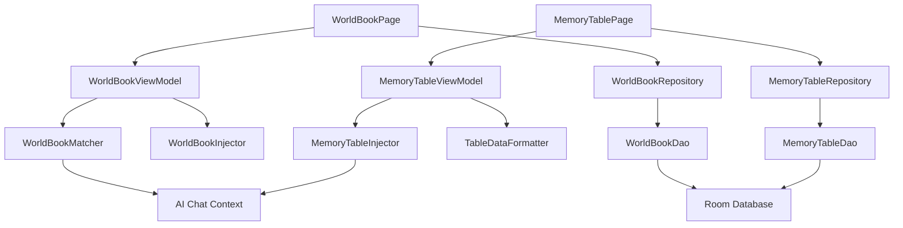

# Design Document

## Overview

World Book和Memory Table功能将为RikkaHub Android LLM聊天客户端添加知识库管理和动态数据表格功能。该设计充分利用现有的Room数据库、Koin依赖注入和Jetpack Compose架构，将现有的Fragment实现完全迁移到现代Compose UI架构，同时优化算法性能和用户体验。

## Steering Document Alignment

### Technical Standards (tech.md)
设计遵循RikkaHub现有的技术栈和最佳实践：
- **Jetpack Compose**: 使用现代化声明式UI框架替换Fragment
- **MVVM架构**: 通过ViewModel管理UI状态和业务逻辑
- **Repository模式**: 数据访问层抽象，便于测试和维护
- **Koin依赖注入**: 保持与主应用一致的依赖管理
- **Room数据库**: 利用现有数据库架构，添加必要的索引优化

### Project Structure (structure.md)
实现将遵循现有的模块化组织：
- **app/ui/pages/worldbook/**: World Book功能的Compose页面和ViewModel
- **app/ui/pages/memorytable/**: Memory Table功能的Compose页面和ViewModel
- **app/data/repository/**: 数据访问层实现
- **app/service/**: 业务逻辑服务层
- **app/data/db/entity/**: 数据库实体定义（已存在）

## Code Reuse Analysis

### Existing Components to Leverage
- **SettingProviderPage.kt**: 作为页面布局和导航的参考模板
- **FormItem组件**: 用于表单布局的一致性UI组件
- **Lucide图标库**: 统一的图标系统
- **LocalToaster**: 统一的消息提示系统
- **PreferencesStore**: 设置存储机制

### Integration Points
- **现有导航系统**: 将新页面集成到Navigation Compose路由中
- **AI聊天系统**: 通过WorldBookInjector和MemoryTableInjector集成到对话流程
- **数据库架构**: 扩展现有的AppDatabase，添加新索引
- **主题系统**: 遵循Material Design 3和现有主题规范

## Architecture

### Modular Design Principles
- **Single File Responsibility**: 每个Compose页面负责单一功能界面
- **Component Isolation**: 创建可复用的UI组件（如条目编辑器、表格单元格）
- **Service Layer Separation**: 分离数据访问、业务逻辑和UI展示
- **Utility Modularity**: 将匹配算法、格式化工具等独立为工具模块



## Components and Interfaces

### WorldBookPage (Compose)
- **Purpose:** World Book功能的主界面，提供条目管理UI
- **Interfaces:**
  - `onCreateEntry()`: 创建新条目
  - `onEditEntry(entry)`: 编辑现有条目
  - `onDeleteEntry(entry)`: 删除条目
  - `onSearch(query)`: 搜索条目
- **Dependencies:** WorldBookViewModel, Navigation Controller
- **Reuses:** SettingProviderPage布局模式, FormItem组件

### WorldBookViewModel
- **Purpose:** 管理World Book UI状态和业务逻辑
- **Interfaces:**
  - `loadEntries()`: 加载条目列表
  - `saveEntry(entry)`: 保存条目
  - `deleteEntry(entryId)`: 删除条目
  - `searchEntries(query)`: 搜索条目
- **Dependencies:** WorldBookRepository, CoroutineScope
- **Reuses:** 现有ViewModel模式和状态管理

### WorldBookMatcher (优化)
- **Purpose:** 高性能关键词匹配算法
- **Interfaces:**
  - `matchWorldBookEntries(input)`: 匹配相关条目
  - `calculateRelevance(entry, keywords)`: 计算相关性分数
- **Dependencies:** 算法优化工具, 缓存机制
- **Reuses:** 现有匹配逻辑，优化时间复杂度

### MemoryTablePage (Compose)
- **Purpose:** Memory Table功能的主界面，提供表格编辑UI
- **Interfaces:**
  - `onCreateTable()`: 创建新表格
  - `onEditCell(tableId, row, col, value)`: 编辑单元格
  - `onAddRow(tableId)`: 添加行
  - `onAddColumn(tableId, columnName)`: 添加列
- **Dependencies:** MemoryTableViewModel, Table Editor组件
- **Reuses:** 表格UI组件, 拖拽排序功能

### TableEditorComponent (可复用)
- **Purpose:** 动态表格编辑器组件
- **Interfaces:**
  - `onCellChange(row, col, value)`: 单元格值变更
  - `onRowAdd()`: 添加行
  - `onColumnAdd(name)`: 添加列
- **Dependencies:** Compose状态管理, 拖拽手势处理
- **Reuses:** 现有Compose交互模式

## Data Models

### WorldBookEntry (现有，需优化)
```kotlin
@Entity(tableName = "world_book_entries", indices = [
    Index(value = ["keywords"]),
    Index(value = ["priority"]),
    Index(value = ["enabled"])
])
data class WorldBookEntry(
    @PrimaryKey val id: String = UUID.randomUUID().toString(),
    val name: String,
    val content: String,
    val keywords: List<String>, // 存储为JSON字符串
    val priority: Int = 0,
    val enabled: Boolean = true,
    val createdAt: Long = System.currentTimeMillis(),
    val updatedAt: Long = System.currentTimeMillis()
)
```

### MemoryTable (现有，需完善)
```kotlin
@Entity(tableName = "memory_tables", indices = [
    Index(value = ["name"]),
    Index(value = ["createdAt"])
])
data class MemoryTable(
    @PrimaryKey val id: String = UUID.randomUUID().toString(),
    val name: String,
    val columns: List<MemoryColumn>, // 存储为JSON
    val rows: List<MemoryRow>, // 存储为JSON
    val createdAt: Long = System.currentTimeMillis(),
    val updatedAt: Long = System.currentTimeMillis()
)

data class MemoryColumn(
    val name: String,
    val type: ColumnType = ColumnType.TEXT
)

data class MemoryRow(
    val id: String = UUID.randomUUID().toString(),
    val cells: List<String> // 与columns对应的值列表
)

enum class ColumnType {
    TEXT, NUMBER, DATE, BOOLEAN
}
```

## Error Handling

### Error Scenarios
1. **数据库操作失败**
   - **Handling:** 使用try-catch包装Repository操作，通过ViewModel传递错误状态到UI
   - **User Impact:** 显示友好的错误消息和重试按钮

2. **关键词匹配算法性能问题**
   - **Handling:** 实现超时机制和降级策略，缓存匹配结果
   - **User Impact:** 长时间操作时显示进度指示器

3. **内存表格数据损坏**
   - **Handling:** JSON解析异常处理，数据验证和自动修复
   - **User Impact:** 提供数据恢复选项和错误详情

4. **AI上下文注入失败**
   - **Handling:** 优雅降级，记录错误日志，不影响正常对话
   - **User Impact:** 静默处理，可选显示警告信息

## Testing Strategy

### Unit Testing
- **Repository层测试:** 模拟Dao接口，测试CRUD操作
- **ViewModel测试:** 测试状态管理和业务逻辑
- **匹配算法测试:** 验证关键词匹配的准确性和性能
- **工具函数测试:** JSON序列化、数据格式化等

### Integration Testing
- **数据库集成测试:** 测试Room数据库操作和事务
- **AI集成测试:** 测试上下文注入功能
- **导航集成测试:** 测试页面间导航和数据传递

### End-to-End Testing
- **用户流程测试:** 创建、编辑、删除World Book条目
- **表格操作测试:** 创建表格、编辑数据、添加行列
- **AI对话测试:** 验证World Book和Memory Table在对话中的效果
- **性能测试:** 大量数据下的响应时间和内存使用